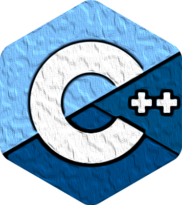

<h1 align='center'>
   Amirreza Jaberi   
</h1>

<b><a href='https://discord.gg/BGZWaFzaUP'>Discord</a></b></h5>

 

I am a self taught developer in Iran 
 
 
<code></code>
<code></code>
<code></code>
<code></code>
<code></code>
<code></code>
<code></code> 

| <a href="https://github.com/anuraghazra/github-readme-stats"><h4>My github status :</h4></a> | <a href="https://github.com/anuraghazra/github-readme-stats"><h4>Most Used :</h4></a>
| ------------- | ------------- |

| <a href="https://github.com/anuraghazra/github-readme-stats"><h4>My Top Repositories :</h4></a>
| ----------------------------- |

| <a href="https://github.com/anuraghazra/github-readme-stats"><h4>My discord status :</h4></a>
| ----------------------------- |

|  | 
| ------------- | ------------- |
